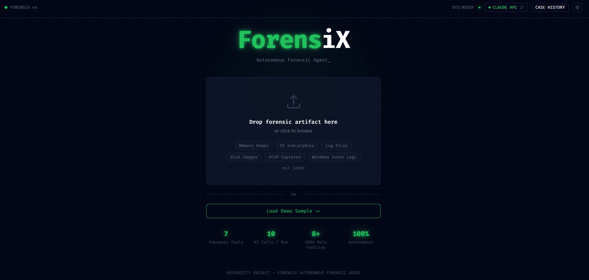
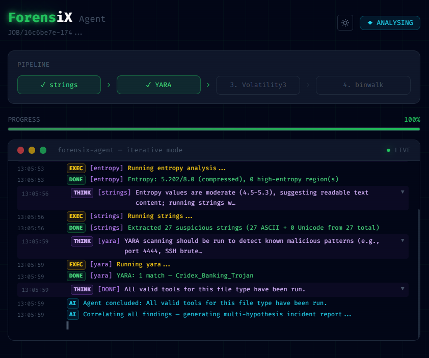
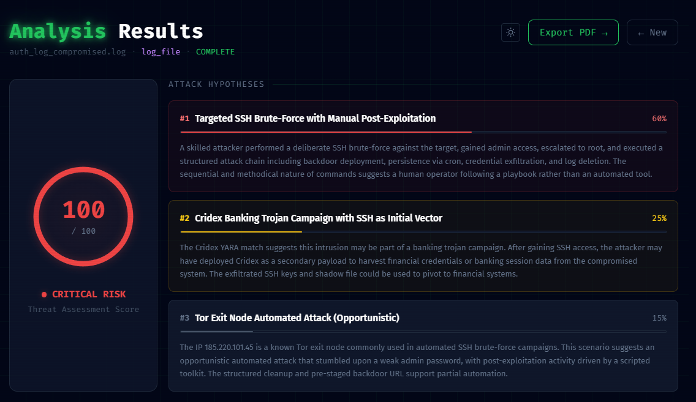
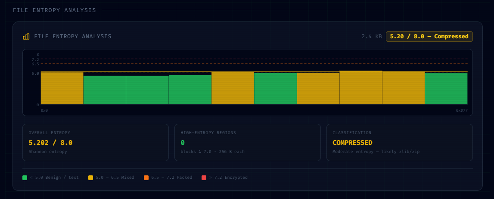
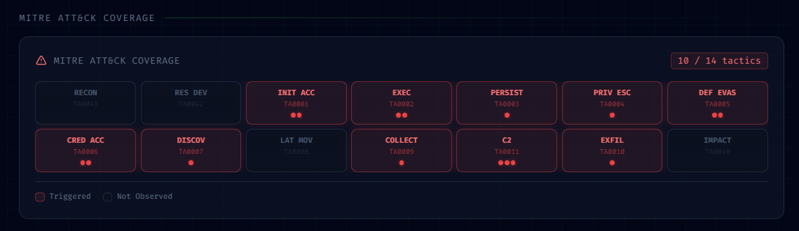
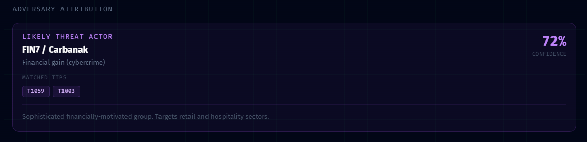
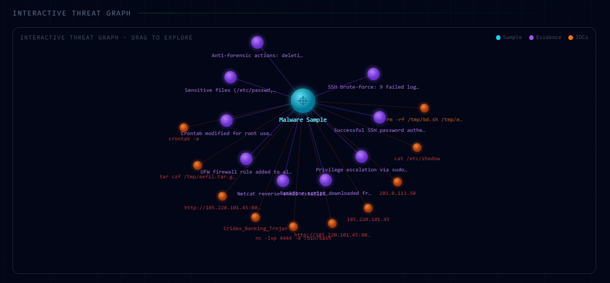
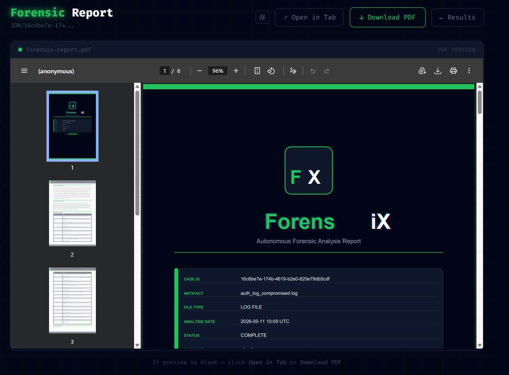

<p align="center">
  
</p>

<p align="center">
  <strong>Autonomous Forensic Agent. From Artefact to Incident Report.</strong>
</p>

<p align="center">
  
  
  
  
  
</p>

---

## Screenshots

**Upload Page**

*Drag-and-drop artifact upload zone with AI mode toggle (Claude / Ollama) and Load Demo Sample button.*

**Live Agent Terminal**

*Real-time WebSocket terminal showing tool execution logs. Purple THINK rows expand to reveal the LLM's chain-of-thought reasoning at each step.*

**Attack Hypotheses and Risk Score**

*Animated 0–100 risk gauge alongside three ranked attack hypotheses with confidence bars generated by the correlator.*

**File Entropy Analysis**

*Per-block Shannon entropy histogram with dashed threshold lines at 5.0, 6.5, and 7.2. Classifies the artifact as benign, compressed, packed, or encrypted.*

**MITRE ATT&CK Coverage**

*14-tactic ATT&CK heatmap. Triggered tactics highlighted in red with matched technique IDs shown as dots and hover tooltips.*

**Adversary Attribution**

*Rule-based threat actor card showing matched actor, motivation, confidence percentage, and matched TTP badges — no LLM call.*

**Interactive Threat Graph**

*Physics-based SVG force graph linking the artifact root to evidence nodes and IOC nodes. Fully draggable.*

**PDF Report**

*Inline ReportLab-generated PDF preview with dark cover page, confidence bars, forensic timeline, and suspicious strings table.*

**Case History**

*Persistent case list showing past analyses with filename, job ID, file type, and completion status.*

**Incident Timeline with MITRE Badges**

*Chronological event list with MITRE technique and tactic badges per event. Click any event to open a raw-output evidence drawer.*

**Suspicious Strings with VirusTotal Enrichment**

*Up to 10 IOCs flagged by the LLM with severity (Critical / High / Medium / Low) and live VirusTotal detection counts per entry.*

**Evidence Table**

*All correlated findings with source tool label and rule-based confidence percentage bars.*

**Tool Execution Grid and Agent Reasoning Log**

*Per-tool success/failure grid followed by the collapsible agent reasoning log showing every AI tool-selection decision with chosen tool, reasoning text, and running findings summary.*

---

## Overview

ForensiX is an AI-powered digital forensic analysis platform built as a university capstone project. Upload a forensic artefact (memory dump, PE executable, network capture, Windows Event Log, or log file) and the system autonomously selects and runs the appropriate forensic tools, correlates findings across all outputs, maps observed behaviors to the MITRE ATT&CK framework, and generates a professional PDF incident report.

The AI agent mimics the decision-making of an experienced forensic analyst: it picks tools based on live findings, explains every decision, and stops when it has sufficient evidence. No manual configuration. No tool selection. One upload, full report.

---

## Pipeline

```
Upload
  |
  |-- File Type Detection (python-magic)
  |
  |-- Entropy Analysis                    always first, no LLM call
  |
  |-- Agent Loop  (max 9 iterations)
  |     |-- LLM selects next tool
  |     |-- Tool executes -> structured output
  |     |-- Decision + reasoning logged -> streamed over WebSocket
  |     `-- Repeat until DONE
  |
  |-- Correlation                         1 final LLM call
  |     |-- 3 ranked attack hypotheses
  |     |-- Incident timeline (tool-sourced events)
  |     |-- MITRE ATT&CK tactic mapping
  |     |-- Suspicious strings with severity
  |     `-- Executive summary
  |
  |-- Confidence Scoring                  rule-based, no LLM
  |-- Adversary Attribution               TTP lookup, 6 threat actor profiles
  |-- VirusTotal Enrichment               per IOC (optional)
  `-- PDF Report                          generated on demand
```

---

## Quick Start

**Prerequisites:** Docker Desktop

```bash
# Clone the repository
git clone <repo-url>
cd ForensiX

# Configure environment
cp .env.example .env
# Open .env and set ANTHROPIC_API_KEY=<your-key>

# Build and run
docker compose up --build
```

| Service  | URL                   |
|----------|-----------------------|
| Frontend | http://localhost:3000 |
| Backend  | http://localhost:8000 |

No local tool installation required. All forensic tools are installed inside Docker at build time.

---

## Supported Artefact Types

| Artefact Type      | Extensions                    |
|--------------------|-------------------------------|
| Memory dumps       | `.vmem` `.dmp` `.raw` `.lime` |
| PE executables     | `.exe` `.dll`                 |
| Network captures   | `.pcap` `.pcapng`             |
| Windows Event Logs | `.evtx`                       |
| Log files          | `.log` `.txt`                 |

---

## Forensic Tools

| Tool            | Role |
|-----------------|------|
| **entropy**     | Shannon entropy per block. Classifies file as benign / compressed / packed / encrypted. Runs first on every file. |
| **strings**     | Extracts domains, IPs, registry keys, file paths, and API call names from binary artefacts. |
| **yara**        | Signature-based malware scanning across bundled rule families: ransomware, banking trojans, keyloggers, rootkits. |
| **volatility3** | Memory forensics: running processes, network connections, command-line arguments, OS banner detection. |
| **binwalk**     | Detects embedded files, compressed archives, and firmware segments hidden inside binary files. |
| **pcap**        | Network traffic analysis: DNS queries, HTTP requests, unique external IPs. |
| **evtx**        | Windows Event Log parser targeting high-signal Event IDs: 4688 (process creation), 4624 (logon), 7045 (service install). |

---

## Results Page

After analysis completes, the Results page presents findings across eleven sections:

| # | Section | Description |
|---|---------|-------------|
| 1 | **Threat Risk Score** | Animated 0-100 radial gauge with 3 ranked attack hypotheses and confidence bars |
| 2 | **File Entropy Chart** | Per-block SVG histogram with threshold lines at 5.0 / 6.5 / 7.2 and classification badge |
| 3 | **MITRE ATT&CK Heatmap** | 14-tactic interactive grid with matched tactics highlighted and technique tooltips |
| 4 | **Adversary Attribution** | Threat actor card (APT28, Lazarus Group, FIN7, etc.) when TTP overlap meets confidence threshold |
| 5 | **Executive Summary** | AI-generated one-paragraph overview for non-technical audiences |
| 6 | **Incident Timeline** | Chronological event list. Click any event to open a raw-output evidence drawer. |
| 7 | **Threat Graph** | Physics-based SVG force graph: sample -> evidence nodes -> IOC nodes |
| 8 | **Evidence Table** | All findings with source tool and rule-based confidence percentage |
| 9 | **Suspicious Strings** | Up to 10 IOCs flagged with severity (Critical / High / Medium / Low) and VirusTotal detections |
| 10 | **Tool Execution Grid** | Per-tool success / failure status |
| 11 | **Agent Reasoning Log** | Every AI tool-selection decision with chosen tool, reasoning text, and running findings summary |

---

## AI Backends

ForensiX supports two interchangeable AI backends. Switch between them from the Upload page with no restart required.

| Mode | Model | API Key | Internet | Quality |
|------|-------|---------|----------|---------|
| **Claude** (default) | `claude-sonnet-4-6` | Required | Required | Best |
| **Ollama** (local) | `llama3.2` (configurable) | None | None | Good |

If Claude mode is selected and the API call fails, the job fails with a descriptive error (authentication failure, rate limit, timeout, etc.). There is no silent fallback to Ollama.

---

## Environment Variables

| Variable | Default | Required | Description |
|----------|---------|----------|-------------|
| `AI_MODE` | `claude` | No | `claude` or `ollama` |
| `ANTHROPIC_API_KEY` | | Claude mode | Anthropic API key |
| `OLLAMA_BASE_URL` | `http://host.docker.internal:11434` | No | Ollama server address |
| `OLLAMA_MODEL` | `llama3.2` | No | Ollama model name |
| `VT_API_KEY` | | No | VirusTotal API key for IOC enrichment |

---

## Demo

The repository includes a bundled demo artefact. No external files needed.

1. Open **http://localhost:3000**
2. Click **Load Demo Sample** to load `cridex.vmem`, a real Windows XP memory image with a Cridex banking trojan infection
3. Watch the live terminal as the agent runs strings, YARA, and Volatility3
4. Review the Results page. The system identifies a malicious PDF exploit, a suspicious `reader_sl.exe` process, and C2 connections on port 8080.
5. Download the PDF report

Full analysis completes in approximately 60 seconds. If Volatility3 cannot parse the image, the system falls back to pre-computed cached results so the demo always succeeds.

---

## Project Structure

```
ForensiX/
|-- backend/
|   |-- pipeline/        # llm_client, executor, selector, correlator, adversary, confidence, health, router
|   |-- routers/         # upload.py (file ingestion), ws.py (WebSocket)
|   |-- tools/           # one module per forensic tool
|   |-- report/          # PDF builder (ReportLab)
|   |-- yara_rules/      # bundled YARA rule files
|   |-- main.py          # FastAPI app entry point
|   |-- models.py        # Pydantic models shared across pipeline
|   |-- job_store.py     # in-memory job state + WebSocket event buffer
|   `-- db.py            # SQLite persistence for completed cases
|-- frontend/
|   `-- src/
|       |-- pages/       # Upload, LiveAgent, Results, Report, History
|       `-- components/  # ThreatGraph, MitreHeatmap, EntropyChart, Timeline, ...
|-- sample/              # cridex.vmem demo artefact
|-- docs/
|   |-- ForensiX_Documentation.md
|   `-- screenshots/
|-- docker-compose.yml
`-- .env.example
```

---

## Tech Stack

| Layer | Technology |
|-------|------------|
| Frontend | React 18, TypeScript, Vite, Tailwind CSS |
| Backend | Python 3.11, FastAPI, Uvicorn |
| AI | Anthropic SDK (Claude), Ollama HTTP client |
| Forensics | strings, yara-python, Volatility3, binwalk, tshark, python-evtx |
| Report | ReportLab |
| Infrastructure | Docker, Docker Compose, Nginx |

---

## Documentation

Full technical documentation including system architecture, agent decision-making flow, tool descriptions, API reference, and implementation details:

**[docs/ForensiX\_Documentation.md](docs/ForensiX_Documentation.md)**

---

## Team

| Name |
|------|
| Ahmed Aamer | 
| Youssef Hazem | 
| Mohamed Ahmed | 
| Ali Hesham | 

**Supervisor:** Dr. Mohamed Hamhme  
**Institution:** Arab Academy for Science, Technology and Maritime Transport  
**Programme:** Computer Science, Cyber Security
