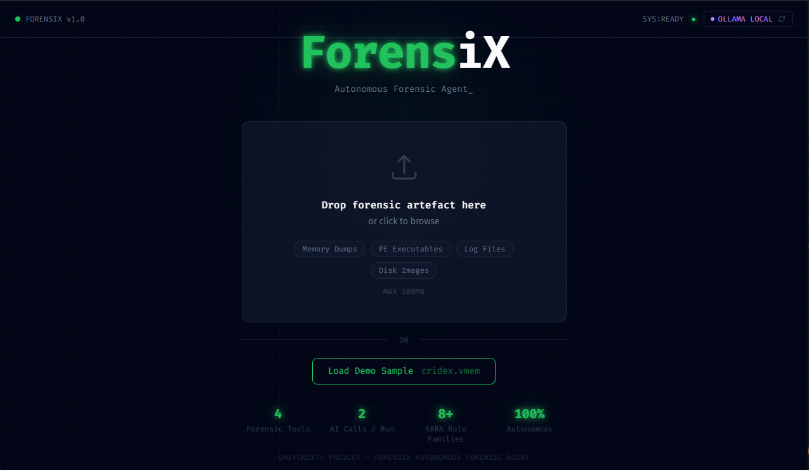
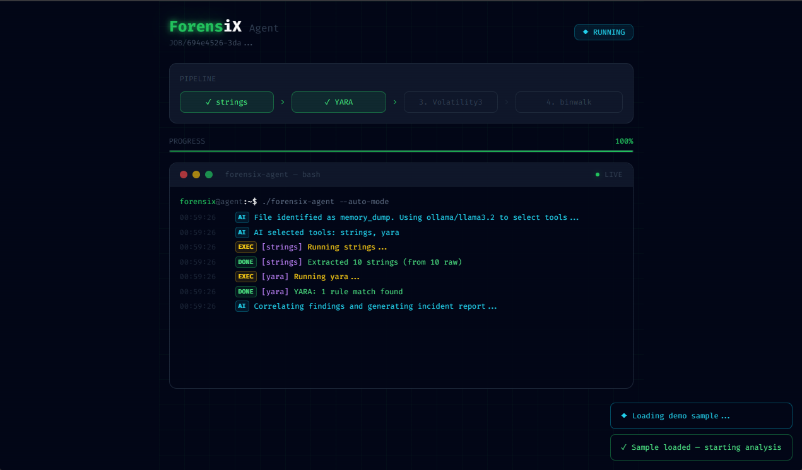
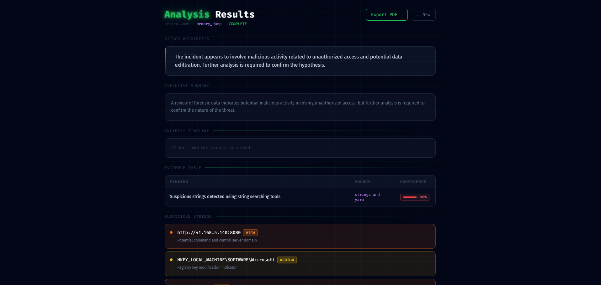
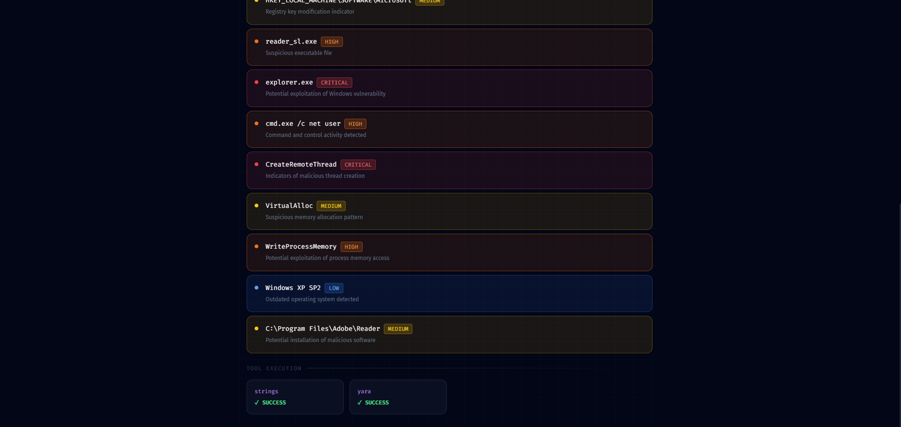
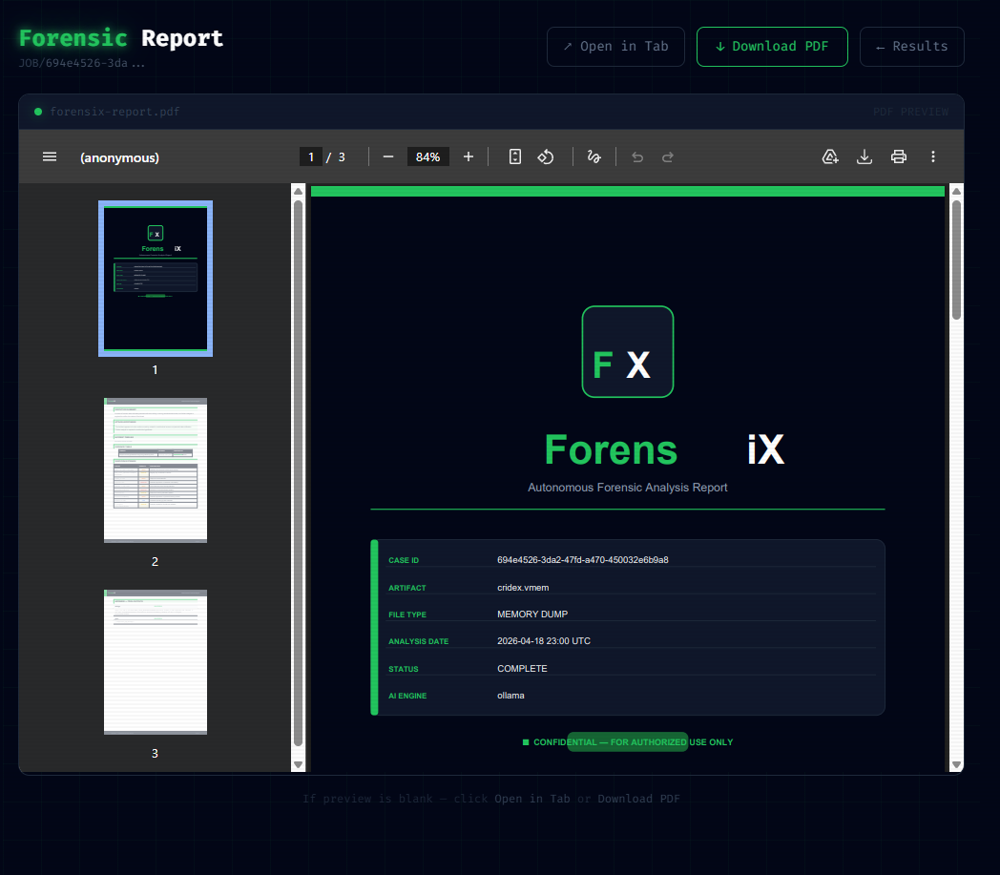

<div align="center">

# 🔍 ForensiX
### Autonomous Forensic Agent

**From artefact to incident timeline — powered by AI**

[](https://python.org)
[](https://fastapi.tiangolo.com)
[](https://react.dev)
[](https://tailwindcss.com)
[](https://docker.com)
[](https://anthropic.com)
[](https://ollama.ai)
[](LICENSE)

<br/>

> Upload a forensic artefact. Watch the AI decide which tools to run.
> Get a full incident report in minutes — no manual analysis required.

<br/>

[Features](#-features) • [Quick Start](#-quick-start) • [How It Works](#-how-it-works) • [AI Modes](#-ai-modes) • [Screenshots](#-screenshots) • [Tech Stack](#-tech-stack) • [Project Structure](#-project-structure) • [Contributing](#-contributing)

</div>

---

## What Is ForensiX?

ForensiX is an autonomous digital forensic analysis platform. You upload a forensic artefact — a memory dump, a Windows executable, a log file — and an AI agent takes over. It identifies the artefact type, selects the right forensic tools, runs them step by step, correlates all findings, and delivers a professional incident report with a timeline and attack hypothesis.

No manual tool selection. No copy-pasting output between tools. No writing reports from scratch.

The system is built for cybersecurity students, researchers, and analysts who want to demonstrate or prototype AI-assisted forensic workflows. It runs entirely in Docker and supports both the Claude API and free local LLMs via Ollama.

---

## ✨ Features

| Feature | Description |
|---------|-------------|
| **Artefact Type Detection** | Automatically classifies uploads using magic byte analysis |
| **Iterative Agent Loop** | Agent decides each tool step-by-step (up to 10 LLM calls), not a hardcoded sequence |
| **Agent Reasoning Log** | Every AI decision logged with reasoning — visible live in terminal and in Results |
| **Multi-Tool Execution** | Runs entropy, strings, YARA, Volatility3, and binwalk as needed |
| **File Entropy Analysis** | Shannon entropy bar chart across 160 blocks with classification (benign/compressed/packed/encrypted) |
| **Live Agent Stream** | Terminal-style real-time feed of every agent action over WebSocket |
| **Findings Correlation** | AI cross-references all tool outputs to build the full picture |
| **Multi-Hypothesis Analysis** | 3 ranked attack scenarios with confidence percentages, not just one hypothesis |
| **Adversary Attribution** | Matches observed TTPs against 6 known threat actor profiles (APT28, Lazarus, etc.) |
| **Evidence-Linked Timeline** | Click any timeline event to open a drawer with the raw tool output that produced it |
| **Threat Risk Score** | Animated gauge showing composite risk level (0–100) |
| **MITRE ATT&CK Heatmap** | Interactive grid showing which of the 14 MITRE tactics were observed |
| **Interactive Threat Graph** | Physics-based SVG force graph linking the sample to evidence nodes and IOC nodes — drag to explore |
| **Evidence Table** | Findings with source tool and rule-based confidence scores |
| **Suspicious Strings Analysis** | AI flags the most dangerous strings with severity and explanation |
| **VirusTotal Integration** | IOC strings checked against VirusTotal; malicious detections elevate severity to critical |
| **PDF Report Export** | Professionally designed report with dark cover, logo, confidence bars, suspicious strings table |
| **Live AI Mode Toggle** | Switch between Claude API and Ollama from the UI — no restart needed |
| **Dual AI Backend** | Claude API auto-fallback to Ollama when no API key is set |
| **Demo Sample Included** | Bundled `cridex.vmem` memory image with real malware artefacts |
| **Docker Compose Deploy** | One command to run the full stack — no local tool installation |

---

## 🚀 Quick Start

### Prerequisites

- [Docker Desktop](https://www.docker.com/products/docker-desktop/) installed and running
- An Anthropic API key **or** [Ollama](https://ollama.ai) installed locally (see [AI Modes](#-ai-modes))

### 1. Clone the repository

```bash
git clone https://github.com/Aamer930/forensix.git
cd forensix
```

### 2. Add your API key

Edit the `.env` file in the project root and replace `sk-ant-your-key-here` with your real key.

Open `.env` and fill in your details:

```env
# Choose your AI backend: "claude" or "ollama"
AI_MODE=ollama   # default — works out of the box with no API key

# Required if AI_MODE=claude
ANTHROPIC_API_KEY=sk-ant-your-key-here

# Required if AI_MODE=ollama
OLLAMA_BASE_URL=http://host.docker.internal:11434
OLLAMA_MODEL=llama3.2
```

> **No API key?** Leave `AI_MODE=ollama` (the default). The Claude mode auto-falls back to Ollama if no valid key is detected.
> You can also switch AI backend live from the Upload page UI — no restart required.

### 3. Demo sample

A synthetic demo sample (`sample/cridex.vmem`) is included in the repository. Click **Load Demo Sample** in the UI — no download needed.

> Or upload your own forensic artefact — memory dumps, PE executables, and log files are all supported.

### 4. Start the stack

```bash
docker compose up --build
```

| Service | URL |
|---------|-----|
| Frontend | http://localhost:3000 |
| Backend API | http://localhost:8000 |
| API Docs | http://localhost:8000/docs |

---

## 🔁 How It Works

```
  Upload artefact
        │
        ▼
  ┌─────────────┐      Unsupported type?
  │ FileType    │ ──────────────────────► Error response
  │ Router      │
  └──────┬──────┘
         │
         ▼
  ┌─────────────┐   Step 0 — always mandatory, no LLM call
  │   entropy   │   Shannon entropy analysis + classification
  └──────┬──────┘
         │
         ▼
  ┌─────────────────────────────────────────────────────┐
  │              Iterative Agent Loop                    │
  │              (up to 9 LLM decisions)                 │
  │                                                      │
  │  ┌──────────┐   "What's next given what we know?"   │
  │  │ AI Agent │ ◄──── Claude API  or  Ollama           │
  │  └────┬─────┘                                        │
  │       │ {"next_tool": "volatility3", "reasoning":…}  │
  │       ▼                                              │
  │  Run tool → collect output → repeat until DONE       │
  │                                                      │
  │  Available: strings · YARA · Volatility3 · binwalk   │
  └──────────────────────────┬──────────────────────────┘
                             │  All outputs (normalized JSON)
                             ▼
  ┌─────────────┐      "Correlate everything. Build the timeline."
  │   AI Agent  │ ◄──── Final LLM call
  └──────┬──────┘
         │
         ▼
  ┌──────────────────────────────────────────────┐
  │  Correlation Result                           │
  │  ├── Risk Score (0–100)                       │
  │  ├── MITRE ATT&CK Tactics                     │
  │  ├── Incident Timeline (with tool_source)     │
  │  ├── 3 Ranked Attack Hypotheses               │
  │  ├── Adversary Attribution                    │
  │  ├── Evidence Table + Confidence Scores       │
  │  ├── Suspicious Strings (severity)            │
  │  └── Executive Summary                        │
  └──────────────────┬───────────────────────────┘
                     │
                     ▼
  VirusTotal IOC enrichment  →  Adversary profiling
                     │
                     ▼
  PDF Report  +  Results Page  +  Live Stream (WebSocket)
```

**The agent makes one LLM call per tool decision, then one final call to correlate.** Up to 10 LLM calls per run. Every decision is logged with full reasoning — visible live in the terminal and in the Agent Reasoning Log on the Results page.

---

## 🤖 AI Modes

ForensiX supports two interchangeable AI backends. Switch between them by setting `AI_MODE` in your `.env` file, or toggle live from the **Upload page UI** — no restart required.

If `AI_MODE=claude` but no valid API key is set, the system automatically falls back to Ollama.

### Claude API *(Recommended for best quality)*

Uses Anthropic's `claude-sonnet-4-6` model via the cloud API.

```env
AI_MODE=claude
ANTHROPIC_API_KEY=sk-ant-your-key-here
```

- Best reasoning and report quality
- Consistent structured JSON output
- Requires internet connection
- ~$0.01–0.03 per full analysis run
- Get an API key at [console.anthropic.com](https://console.anthropic.com)

### Local Ollama *(Free, offline, no API key)*

Runs an open-source model locally on your machine using [Ollama](https://ollama.ai).

```env
AI_MODE=ollama
OLLAMA_BASE_URL=http://host.docker.internal:11434
OLLAMA_MODEL=llama3.2
```

**Setup:**

```bash
# Install Ollama from https://ollama.ai, then:
ollama pull llama3.2      # ~2GB download
# or
ollama pull mistral       # alternative option
```

- Completely free, unlimited runs
- Works fully offline
- No API key or account required
- Slightly lower output quality than Claude
- Recommended for development, testing, and student use

> Both modes use identical prompts and expect identical output schemas. Switching is instant — no code changes required.

---

## 🛠 Forensic Tools

All tools run inside Docker. Nothing needs to be installed on your host machine.

| Tool | Purpose | Artefact Types |
|------|---------|----------------|
| **entropy** | Shannon entropy analysis — classify file as benign, compressed, packed, or encrypted | All types |
| **strings** | Extract readable text: IPs, URLs, paths, commands | All types |
| **YARA** | Malware signature detection against 8+ rule families | All types |
| **Volatility3** | Memory forensics: processes, network, command lines | Memory dumps |
| **binwalk** | Identify embedded files and binary signatures | Executables, images |

### YARA Rules

ForensiX ships with a bundled ruleset covering:

- Suspicious PE strings and API calls
- Network communication indicators
- Keylogger behavior
- Ransomware patterns
- Zeus / banking trojan signatures
- Generic dropper characteristics
- Credential harvesting tools
- Rootkit indicators

To add your own rules, drop `.yar` files into `backend/yara_rules/`. They are auto-discovered at startup.

---

## 📸 Screenshots

### Upload Page


### Live Agent Stream


```
forensix@agent:~$ ./run_analysis.sh

◆ [AI]         File identified as memory_dump. Asking AI which tools to run...
◆ [AI]         AI selected tools: strings, yara, volatility3
⟳ [strings]    Running strings...
✓ [strings]    Extracted 487 strings (from 12,043 raw)
⟳ [yara]       Running yara...
✓ [yara]       YARA: 3 rule matches found
⟳ [volatility3] Running volatility3...
✓ [vol_imageinfo] Image info: Windows XP SP2 (x86) [5.1.2600]
✓ [vol_pslist]  Found 15 processes
✓ [vol_netscan] Found 2 network connections
✓ [vol_cmdline] Captured 12 command lines
◆ [AI]         Correlating findings and generating incident report...
★             Analysis complete.
```

### Results Page




### PDF Report


---

## 📁 Project Structure

```
forensix/
│
├── backend/                    # FastAPI backend
│   ├── main.py                 # App entry point
│   ├── models.py               # Pydantic models
│   ├── job_store.py            # In-memory job state + WebSocket events
│   │
│   ├── routers/
│   │   ├── upload.py           # POST /upload, POST /upload-sample
│   │   └── ws.py               # WebSocket /ws/{job_id}
│   │
│   ├── pipeline/
│   │   ├── router.py           # File type detection
│   │   ├── selector.py         # AI — iterative tool decision (one call per step)
│   │   ├── executor.py         # Iterative agent loop + event streaming
│   │   ├── correlator.py       # AI — findings correlation + multi-hypothesis
│   │   ├── adversary.py        # Adversary attribution via TTP matching
│   │   └── confidence.py       # Rule-based confidence scoring
│   │
│   ├── tools/
│   │   ├── entropy_tool.py     # Shannon entropy analysis (block-level + overall)
│   │   ├── strings_tool.py     # strings wrapper
│   │   ├── yara_tool.py        # YARA wrapper
│   │   ├── volatility_tool.py  # Volatility3 wrapper (4 modules)
│   │   ├── volatility_cache.py # Cached cridex.vmem results (demo fallback)
│   │   └── binwalk_tool.py     # binwalk wrapper
│   │
│   ├── report/
│   │   └── pdf_builder.py      # ReportLab PDF generation
│   │
│   ├── yara_rules/
│   │   └── malware_common.yar  # Bundled YARA rules
│   │
│   ├── Dockerfile
│   └── requirements.txt
│
├── frontend/                   # React + Vite + Tailwind
│   ├── src/
│   │   ├── pages/
│   │   │   ├── Upload.tsx      # Artefact upload page
│   │   │   ├── LiveAgent.tsx   # Real-time agent stream
│   │   │   ├── Results.tsx     # Timeline + evidence
│   │   │   └── Report.tsx      # PDF preview + download
│   │   │
│   │   ├── components/
│   │   │   ├── TerminalStream.tsx    # Live agent stream (incl. THINK steps)
│   │   │   ├── Timeline.tsx          # Clickable timeline with tool badges
│   │   │   ├── EvidenceDrawer.tsx    # Slide-out raw evidence drawer
│   │   │   ├── HypothesisPanel.tsx   # 3 ranked attack hypotheses
│   │   │   ├── AdversaryCard.tsx     # Threat actor attribution card
│   │   │   ├── EvidenceTable.tsx
│   │   │   ├── ConfidenceBadge.tsx
│   │   │   ├── EntropyChart.tsx      # SVG entropy bar chart
│   │   │   ├── ThreatGraph.tsx       # Physics-based SVG force graph
│   │   │   ├── MitreHeatmap.tsx      # MITRE ATT&CK 14-tactic grid
│   │   │   └── ThreatRiskScore.tsx   # Animated risk gauge
│   │   │
│   │   └── lib/
│   │       └── api.ts          # API client
│   │
│   ├── Dockerfile
│   └── nginx.conf
│
├── sample/
│   └── cridex.vmem             # Demo memory image (download separately)
│
├── docs/
│   └── ForensiX_Documentation.md
│
├── docker-compose.yml
├── .env
└── CLAUDE.md
```

---

## ⚙️ Configuration

All configuration is done through the `.env` file.

| Variable | Required | Default | Description |
|----------|----------|---------|-------------|
| `AI_MODE` | Yes | `ollama` | AI backend to use: `claude` or `ollama` |
| `ANTHROPIC_API_KEY` | If `AI_MODE=claude` | — | Your Anthropic API key |
| `OLLAMA_BASE_URL` | If `AI_MODE=ollama` | `http://host.docker.internal:11434` | Ollama server URL |
| `OLLAMA_MODEL` | If `AI_MODE=ollama` | `llama3.2` | Model name to use |
| `VT_API_KEY` | No | — | VirusTotal API key for IOC enrichment (optional) |

---

## 🧪 API Reference

The backend exposes a REST API at `http://localhost:8000`. Interactive docs available at `/docs`.

| Method | Endpoint | Description |
|--------|----------|-------------|
| `POST` | `/api/upload` | Upload a forensic artefact |
| `POST` | `/api/upload-sample` | Run analysis on the bundled demo sample |
| `GET` | `/api/jobs/{job_id}` | Get job status and results |
| `GET` | `/api/jobs/{job_id}/report` | Download PDF report (attachment) |
| `GET` | `/api/jobs/{job_id}/report/preview` | PDF inline preview for browser |
| `GET` | `/api/ai-mode` | Get current AI backend |
| `POST` | `/api/ai-mode` | Switch AI backend live `{"mode": "claude"\|"ollama"}` |
| `GET` | `/api/sample` | Get demo sample metadata |
| `WS` | `/ws/{job_id}` | WebSocket stream for live events |
| `GET` | `/health` | Health check |

### WebSocket Event Types

```json
{ "type": "llm_thinking", "message": "Correlating findings..." }
{ "type": "llm_reason",   "tool": "volatility3", "message": "Step 1: chose [volatility3] — memory dump detected...", "data": { "step": 1, "chosen_tool": "volatility3", "reasoning": "...", "findings_so_far": "..." } }
{ "type": "step_start",   "tool": "yara",  "message": "Running yara..." }
{ "type": "step_done",    "tool": "yara",  "message": "YARA: 3 rule matches found" }
{ "type": "step_error",   "tool": "yara",  "message": "YARA scan timeout" }
{ "type": "complete",     "message": "Analysis complete." }
{ "type": "error",        "message": "Unsupported file type." }
```

---

## 🧰 Development Setup

To run without Docker (useful for fast iteration):

**Backend:**
```bash
cd backend
python -m venv venv
source venv/bin/activate       # Windows: venv\Scripts\activate
pip install -r requirements.txt

# Install Volatility3
pip install volatility3

export ANTHROPIC_API_KEY=sk-ant-...
export AI_MODE=claude

uvicorn main:app --reload --port 8000
```

**Frontend:**
```bash
cd frontend
npm install
npm run dev                    # Starts at http://localhost:5173
```

The Vite dev server proxies `/api` and `/ws` requests to `localhost:8000` automatically.

---

## 🔒 Security Notes

- ForensiX runs forensic tools on uploaded user files. **Do not expose it to the public internet.**
- It is designed for local use, controlled lab environments, and demos only.
- Upload size is capped at 500MB per file.
- All processing happens inside Docker containers.
- No data is stored permanently — job state lives in application memory and is lost on restart.

---

## 🗺 Roadmap

- [x] Ollama backend integration — live UI toggle, no restart needed
- [x] File entropy analysis with block-level bar chart
- [x] MITRE ATT&CK tactic heatmap (14 tactics, technique→tactic fallback)
- [x] Interactive physics-based threat graph (drag to explore)
- [x] VirusTotal IOC enrichment — malicious detections escalate severity to critical
- [x] Threat risk score gauge (0–100)
- [x] Iterative agent loop — AI decides each tool step, up to 10 LLM calls
- [x] Agent Reasoning Log — every AI decision logged with full reasoning
- [x] Multi-hypothesis analysis — 3 ranked attack scenarios with confidence
- [x] Adversary attribution — TTP matching against 6 known threat actor profiles
- [x] Evidence-linked timeline — click event to view raw tool output in drawer
- [ ] LangGraph-based branching agent (conditional tool chains)
- [ ] Persistent job storage with Redis / SQLite
- [ ] Multi-artefact case management
- [ ] Custom YARA rule upload via UI
- [ ] Streaming AI token output in terminal
- [ ] Additional tools: `exiftool`, `foremost`, PCAP analysis
- [ ] User authentication and case history

---

## 🤝 Contributing

Contributions are welcome. To add a new forensic tool:

1. Create `backend/tools/yourtool_tool.py` — return a `ToolOutput` Pydantic model with `tool`, `success`, `data`, and optional `error`
2. Register it in `pipeline/executor.py::_execute_tool()` with a new `elif tool_name == "yourtool":` branch
3. Add a summary case in `pipeline/executor.py::_summarize_output()`
4. Add the tool name to the available tools list in `pipeline/selector.py` system prompt so the AI can choose it
5. Add output cap logic in `pipeline/correlator.py::_cap_output()` if the tool can produce large outputs

To add YARA rules, drop `.yar` files into `backend/yara_rules/` — they are auto-loaded at startup.

---

## 📄 License

This project is licensed under the MIT License. See [LICENSE](LICENSE) for details.

---

## 📚 References

- [Volatility Foundation](https://volatilityfoundation.org) — Memory forensics framework
- [YARA Rules](https://github.com/Yara-Rules/rules) — Open-source malware signature library
- [Anthropic Claude](https://anthropic.com) — Claude API documentation
- [Ollama](https://ollama.ai) — Local LLM runtime
- [cridex.vmem](https://github.com/volatilityfoundation/volatility/wiki/Memory-Samples) — Public domain Windows XP memory sample

---

<div align="center">

Built as a university cybersecurity project.

**ForensiX** — *Autonomous Forensic Agent*

**Team:** Ahmed Aamer · Youssef Hazem · Mohamed Ahmed · Ali Hesham

*Under the supervision of Dr. Mohamed Hamhme*

[Arab Academy for Science, Technology and Maritime Transport](https://aast.edu) · Computer Science — Cyber Security

</div>
